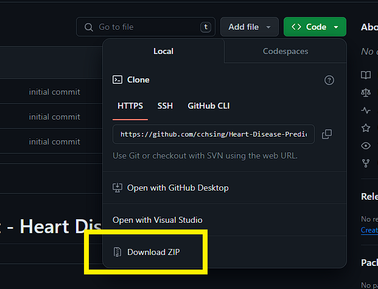

# Data Science Project - Heart Disease Prediction
This is a data science project for heart disease prediction. It is a binary classification problem. The models used are Logistic Regression, K Nearest Neighbors, Decision Tree, and Random Forest. 

## Setup

> **Step 1** Download the Repository
```bash
git clone https://github.com/cchsing/Heart-Disease-Prediction.git
```
or Download from the GitHub website.



> **Step 2** Create a Python Virtual Environment
```bash
cd ./Heart-Disease-Prediction/
python -m venv ./.venv
```

> **Step 3** Install the necessary packages.
```bash
# Activate the virtual environment
./.venv/Script/activate # Windows
source ./.venv/bin/activate # Linux
```
```bash
python -m pip install -r requirements.txt
# or
pip install -r requirements.txt
```

> **Step 4** Run the Jupyter Notebook or Any IDE
```bash
jupyter notebook
# or
jupyter lab
```
